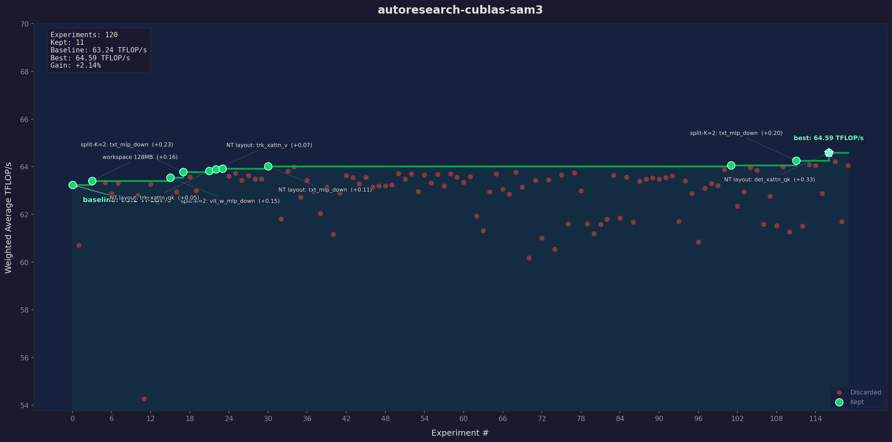

# autoresearch-cublas-sam3

Autonomous AI-driven GEMM kernel tuning for Meta SAM3 inference,
inspired by [Karpathy's autoresearch](https://github.com/karpathy/autoresearch).

An agent iteratively edits a tuning configuration, runs benchmarks on
real GPU hardware, and keeps only the changes that improve performance.
The goal: let an agent discover better BLAS kernel settings for SAM3's
non-standard GEMM shapes overnight.



## Why SAM3?

Most BLAS library tuning targets LLM inference — shapes like (2048, 4096, 4096) with power-of-2 dimensions that tile cleanly. SAM3 (Meta's Segment Anything Model 3) is a worst case for these heuristics:

- **M=5184** (72x72 image tokens) — not a power of 2, not a multiple of 128
- **N=4736** (ViT MLP hidden dim, mlp_ratio=4.625) — not a multiple of 64 or 128
- **N=36288** (tracker cross-attention, 7 memory frames x 5184) — enormous and odd
- **K=256** (detector/tracker head dim) — tiny K makes these shapes memory-bound
- **M=576** (24x24 windowed attention) — 9 small GEMMs that benefit from batching
- **M=32** (text encoder context length) — severely underutilizes the GPU

These shapes expose gaps in kernel selection heuristics that don't show up on LLM benchmarks. Default settings leave 2%+ performance on the table — likely more on hipBLASLt where the tuning database is less mature for vision workloads.

## Works on both NVIDIA and AMD

This repo runs on **any GPU with PyTorch** — NVIDIA or AMD. No code changes needed.

- Auto-detects backend via `torch.version.hip` and GPU device name
- Uses `torch.matmul` / `torch.bmm` / `torch.mm` which route through the appropriate BLAS library automatically
- NVIDIA-specific knobs (`preferred_blas_library`, `allow_tf32`) are wrapped in `try/except` and degrade gracefully on ROCm

```bash
# NVIDIA
pip install torch matplotlib

# AMD (ROCm)
pip install torch --index-url https://download.pytorch.org/whl/rocm6.2
pip install matplotlib
```

## Results

**120 experiments, 11 kept, +2.14% gain** on RTX 3090.

| Iteration | What helped | Gain |
|-----------|------------|------|
| 3 | Workspace 128MB (more algorithm choices) | +0.16 |
| 15 | Split-K=2 for vit_w_mlp_down (576,1024,4736) | +0.15 |
| 17 | Split-K=2 for txt_mlp_down (32,1024,4096) | +0.23 |
| 21 | NT layout for trk_xattn_qk (5184,36288,256) | +0.05 |
| 22 | NT layout for trk_xattn_v (5184,256,36288) | +0.07 |
| 23 | NT layout for vit_g_mlp_down (5184,1024,4736) | +0.02 |
| 30 | NT layout for txt_mlp_down (32,1024,4096) | +0.11 |
| 101 | Batch=6 windows (was 9) | +0.04 |
| 111 | BF16 + split-K=2 for txt_mlp_down | +0.20 |
| 116 | **cuBLAS + NT for det_xattn_qk (400,5184,256)** | **+0.33** |

### Key findings

1. **NT layout is the biggest lever** — 4 of 16 shapes preferred transposed B. Shapes with extreme K/N ratio (K=256, N=36288) benefit most.
2. **Legacy cuBLAS can beat cuBLASLt** — the single biggest win came from switching to legacy cuBLAS for det_xattn_qk. The cuBLASLt heuristic picked a suboptimal kernel for this (400,5184,256) shape.
3. **Split-K=2 helps small-M shapes** — M=32 and M=576 don't fill the GPU; split-K adds parallelism. Split-K=4 and above always hurt.
4. **BF16 > FP16 consistently**.
5. **Padding is catastrophic** — pad-to-256 dropped performance 15%. SAM3's dimensions are large enough that padding waste dominates.

### What didn't work (109 rejected experiments)

- FP16 (consistently 2-3 TFLOP/s slower than BF16)
- Padding to 64/128/256 (wasted compute > alignment benefit)
- Split-K=4, 8 (reduction overhead too high)
- Precision changes (medium/highest — no effect on FP16/BF16 inputs)
- Disabling TF32
- Most parameter combinations (no synergy)

## Files

| File | Editable? | Purpose |
|------|-----------|---------|
| `tune_config.py` | **YES** | Tuning knobs: dtype, precision, padding, layout, batching |
| `program.md` | no* | Agent instructions (the "research org" prompt) |
| `benchmark.py` | no | Frozen: measures TFLOP/s across 16 SAM3 GEMM shapes |
| `verify.py` | no | Frozen: correctness gate |
| `run.sh` | no | Frozen: single-iteration keep/revert loop |
| `agent_loop.py` | no | Autoresearch loop — LLM dynamically designs experiments |
| `agent_brain.py` | no | Scripted fallback (pre-programmed experiments, no API key) |
| `search.py` | no | One-shot scripted search |
| `plot_progress.py` | no | Karpathy-style progress chart |
| `sam3_shapes.py` | no | SAM3 GEMM shape catalog with analysis |
| `iteration_log.jsonl` | generated | Full experiment history |
| `progress.png` | generated | Progress chart |

*You (the human) can iterate on `program.md` to improve agent behavior.

## Quick start

### Option 1: LLM agent (true autoresearch)

The LLM reads benchmark results, reasons about which shapes are weakest,
and dynamically designs each experiment. No fixed script — the agent
invents novel hypotheses that a scripted search wouldn't try.

```bash
pip install torch matplotlib anthropic
export ANTHROPIC_API_KEY=sk-ant-...

python3 agent_loop.py --iterations 100   # LLM designs 100 experiments
python3 plot_progress.py                 # generate progress chart
```

Works with any OpenAI-compatible API (local LLMs, vLLM, etc.):

```bash
pip install torch matplotlib openai
export OPENAI_API_KEY=...
export OPENAI_BASE_URL=http://localhost:8000/v1

python3 agent_loop.py --provider openai --model my-model --iterations 100
```

### Option 2: Scripted fallback (no API key)

Pre-programmed experiment list. Useful for demo purposes, but this is
NOT true autoresearch — the experiments are hardcoded, not dynamically
designed by an LLM.

```bash
pip install torch matplotlib

python3 agent_loop.py --mode scripted --iterations 100
```

### Option 3: Claude Code

```bash
# Open this directory in Claude Code, then:
# "Follow the instructions in program.md"
```

## How it works

Each iteration, the LLM receives the current config, per-shape benchmark
results, and experiment history. It reasons about what to try and outputs
a modified tune_config.py with exactly one change.

```
while true:
    LLM reads last_result.json + tune_config.py + history
    LLM reasons: "shape X is weakest because... I hypothesize..."
    LLM outputs modified tune_config.py
    python verify.py        # correctness gate
    python benchmark.py     # measure TFLOP/s
    if score improved:
        git commit           # keep
    else:
        git checkout tune_config.py  # revert
    agent sees result, proposes next change
```

## What the agent tunes

| Knob | What it does |
|------|-------------|
| `DTYPE` | float16 vs bfloat16 |
| `MATMUL_PRECISION` | TF32 accumulation mode |
| `PREFERRED_BLAS` | cuBLAS vs cuBLASLt |
| `PAD_TO_MULTIPLE` | Pad dimensions to 64/128/256 |
| `WORKSPACE_MB` | BLAS scratch memory |
| `BATCH_WINDOW_GEMMS` | Batch windowed GEMMs |
| `TRANSPOSE_B_MAP` | Per-shape NN vs NT layout |
| `SPLIT_K_MAP` | K-dimension decomposition |

## Other solution spaces for autoresearch

This repo explores GEMM kernel selection for SAM3. The same autoresearch pattern — agent edits config, runs experiment, keeps/reverts — can be applied to other optimization problems:

- **RCCL collective heuristics** — ring vs tree topology, chunk sizes, number of channels, protocol selection per message size
- **rocMLIR / MIGraphX lowering** — operator fusion rules, codegen tile sizes, memory layout choices, scheduling heuristics
- **Triton kernel autotuning** — block sizes, number of warps, number of stages, and fusion strategies for ops like RMSNorm, RoPE, SwiGLU
- **Compiler flag search** — `-O` levels, loop unrolling factors, vectorization widths, inline thresholds for performance-critical libraries

Each of these has the same structure: a large search space of discrete knobs, a measurable performance metric, and a correctness gate.

## Hardware

Runs on any NVIDIA or AMD GPU with PyTorch.

| Platform | GPU | How to get it |
|----------|-----|---------------|
| **Local NVIDIA** | RTX 3090, 4090, A100 | Any workstation |
| **AWS NVIDIA** | A10G (g5.xlarge ~$1/hr) | `setup_aws.sh` |
| **AMD cloud** | MI300X | TensorWave, RunPod, Vultr |
| **Local AMD** | MI300X, MI250, RX 7900 | ROCm 6.x + PyTorch |
